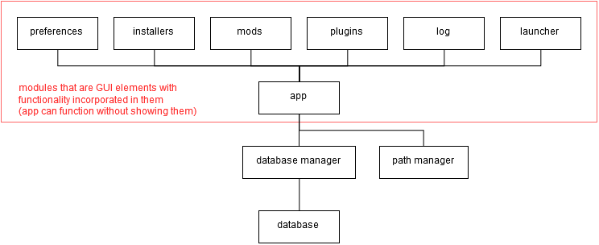

# Keening
Tiny little sideproject.

## Requirements
* Python 3.5.2+
* PyQt 5.7+

## Overall Design Sketch
The overall idea behind the program, drawn to keep the general structure reasonable and/or in check, to avoid constant restructuring and making modules up on the fly. Only exists as a general guideline for myself.

